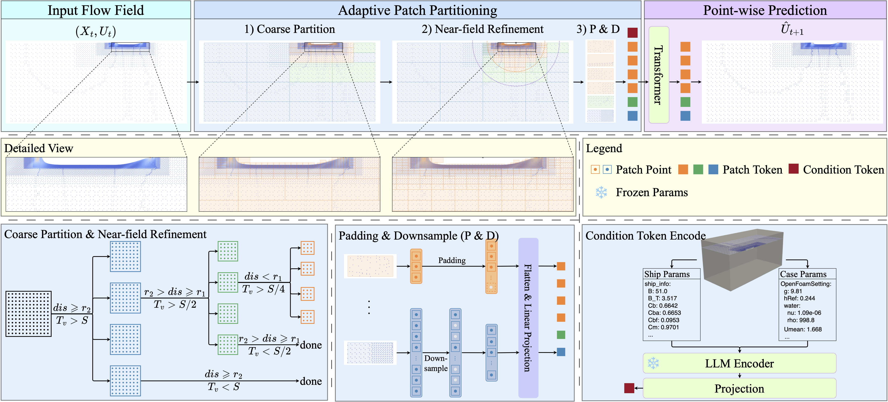
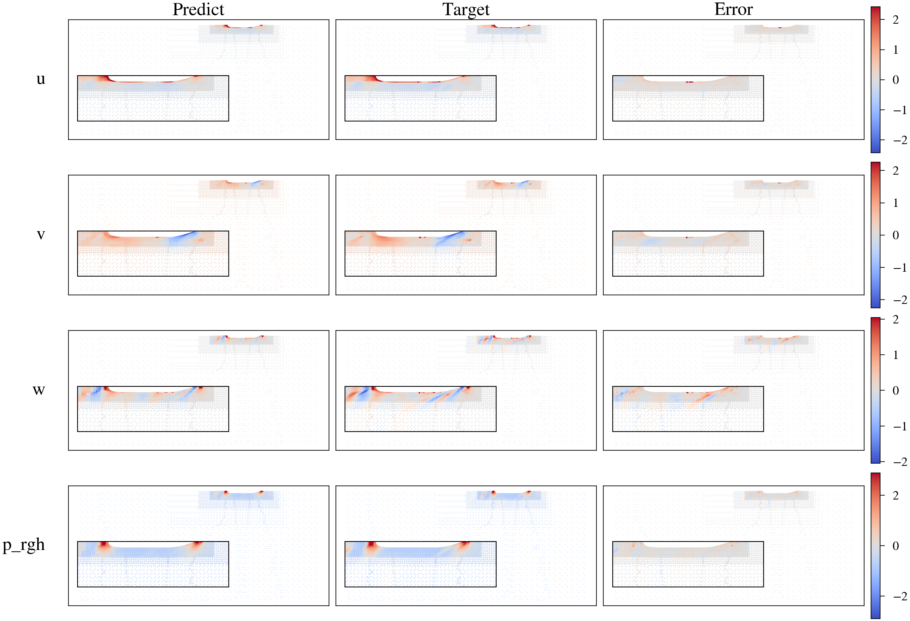

# APPSolver

This repository accompanies the paper:

- Title: **APPSolver: Adaptive Patch Partitioning for Point-Wise Ship Flow Prediction on Unstructured Meshes**

APPSolver formulates ship flow field prediction as a one-step temporal advancement task on the original unstructured CFD mesh. The core idea is Adaptive Patch Partitioning (APP), which converts non-uniform free-surface points into patch tokens, then predicts the next-step point-wise flow field with a Transformer-based backbone and condition tokens.

## Method Overview

APPSolver partitions irregular CFD mesh points into adaptive patches, encodes patch-wise flow tokens with condition embeddings, and predicts the next-step point-wise flow field on the original mesh.

Architecture overview ([PDF source](pics/arch.pdf)):

[](pics/arch.pdf)

Qualitative APP-Transformer prediction result:



## Repository Structure

```text
APPsolver/
├── src/
│   ├── core/
│   ├── data_processor/
│   ├── datasets/
│   └── models/
├── scripts/
│   ├── train_patch.py
│   ├── train_irregular.py
│   └── precompute_ship_embeddings.py
├── requirements.txt
└── README.md
```

Main code modules:

- `src/data_processor/`: APP / quad-tree processing
- `src/datasets/`: shipBench and cfdBench dataset loaders
- `src/models/`: APP patch models and irregular baseline models
- `src/core/`: training, metrics, and checkpoint utilities
- `scripts/`: training, evaluation, and experiment entry points

## Environment Setup

1. Create environment.

```bash
conda create -n appsolver python=3.12 -y
conda activate appsolver
```

2. Install PyTorch first.

```bash
pip install torch==2.8.0 --index-url https://download.pytorch.org/whl/cpu
```

or

```bash
pip install torch==2.8.0+cu128 --index-url https://download.pytorch.org/whl/cu128
```

3. Install the remaining dependencies.

```bash
pip install -r requirements.txt
```

## Dataset Prepare

You can download our ShipBench dataset via [Baidu Drive](https://pan.baidu.com/s/1DVz_6-_rM2jfzSNlO7deBg?pwd=c29d2). Then extract file in workdir, it should looks like this:

```text
datasets/
└── shipBench/
    └── DTC/
        └── field/
            └── 1Re/
                ├── flow_cache.npz
                ├── timestep_000.csv
                └── ...
```

Our Method can be also trained on CFDBench Raw Data. You can download the CFDBench dataset via [CFDBench](https://github.com/luo-yining/CFDBench). The dataset should looks likes below:

```text
datasets/
└── cfdBench/
    └── 01_cavityflow/
        └── case0/
            ├── cfd_params.yaml (this can be generated through the interpolated CFDBench data but a little complex, you can skip it)
            ├── data0-0001.txt
            ├── data0-0002.txt
            ├── ...
            ├── data0-0028.txt
            └── flow_cache.npz
```

## Quick Start

All commands below should be run from the project root.

### 1. Build flow caches

Build `flow_cache.npz` from raw ShipBench `timestep_*.csv` files and CFDBench `data*.txt` files. The script automatically discovers valid dataset directories under the given roots.

```bash
python scripts/build_flow_cache.py \
  --dataset all \
  --ship-root datasets/shipBench \
  --cfd-root datasets/cfdBench
```

This generates `flow_cache.npz` in each discovered data directory. Add `--overwrite` if you need to rebuild existing cache files.

### 2. Precompute LLM condition embeddings

```bash
python scripts/precompute_ship_embeddings.py \
  --data_dir datasets/shipBench/DTC/field/1Re \
  --llm_model Qwen/Qwen2.5-0.5B \
  --output_dir datasets/shipBench/DTC/field/1Re
```

This generates `ship_params_embedding.pt` under the condition directory.

### 3. Train APP-Transformer

```bash
python scripts/train_patch.py \
  --model transformer \
  --dataset_type ship \
  --data_dirs datasets/shipBench/DTC/field/1Re \
  --patch_size 256 \
  --enable_downsample \
  --downsample_method distance \
  --downsample_ratio 0.6 \
  --max_steps 10000 \
  --eval_every 2000 \
  --log_every 2000 \
  --batch_size 4 \
  --seed 42 \
  --d_model 128 \
  --nhead 8 \
  --n_heads 8 \
  --num_layers 6 \
  --features 192 \
  --use_embedding \
  --embedding_mode precomputed \
  --embedding_filename ship_params_embedding.pt \
  --save_dir outputs/quickstart/transformer
```

### 4. Train DPT

```bash
python scripts/train_patch.py \
  --model dpt \
  --dataset_type ship \
  --data_dirs datasets/shipBench/DTC/field/1Re \
  --patch_size 256 \
  --enable_downsample \
  --downsample_method distance \
  --downsample_ratio 0.6 \
  --max_steps 10000 \
  --eval_every 2000 \
  --log_every 2000 \
  --batch_size 4 \
  --seed 42 \
  --d_model 128 \
  --nhead 8 \
  --n_heads 8 \
  --num_layers 6 \
  --features 192 \
  --use_embedding \
  --embedding_mode precomputed \
  --embedding_filename ship_params_embedding.pt \
  --save_dir outputs/quickstart/dpt
```

## Citation

As my first paper, I want to summit it on arXiv, but I haven’t been endorsed by arXiv yet :melting_face: .
